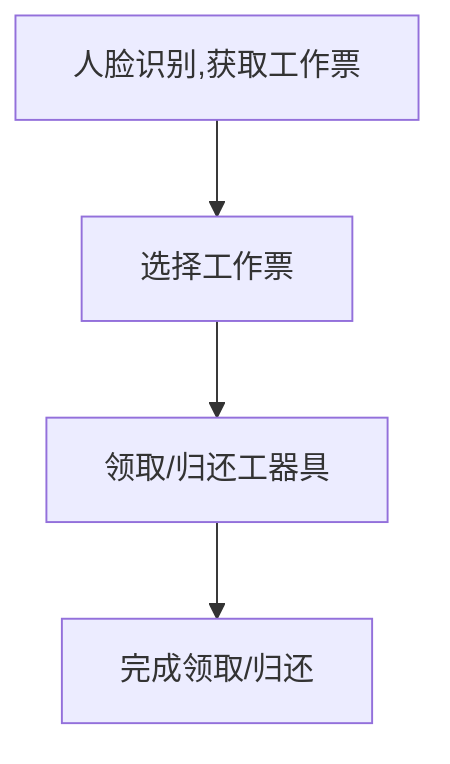
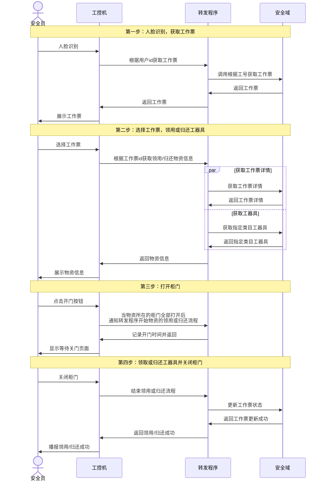

# 转发程序

## 项目背景

| framework   | version |
|-------------|---------|
| JDK         | 17      |
| spring-boot | 3.0.4   |

兼容

## 领用单步骤

```mermaid
flowchart TB
    fst[人脸识别,获取工作票]
    snd[选择工作票]
    trd[领取/归还工器具]
    4th[完成领取/归还]
    fst --> snd --> trd --> 4th
```

## 仓库转发（对接信德佳）

```mermaid
sequenceDiagram
    actor Security as 安全员
    participant IPC as 工控机
    participant Forward as 转发程序
    participant Middle as 安全域
%%    step 1
    Note over Security, Middle: 第一步：人脸识别，获取工作票
    Security ->> IPC: 人脸识别
    IPC ->> Forward: 根据用户id获取工作票
    Forward ->> Middle: 调用根据工号获取工作票
    Middle ->> Forward: 返回工作票
    Forward ->> IPC: 返回工作票
    IPC ->> Security: 展示工作票
%% step 2
    Note over Security, Middle: 第二步：选择工作票，领用或归还工器具
    Security ->> IPC: 选择工作票
    IPC ->> Forward: 根据工作票id获取领用/归还物资信息
    par 获取工作票详情
        Forward ->> Middle: 获取工作票详情
        Middle ->> Forward: 返回工作票详情
    and 获取工器具
        Forward ->> Middle: 获取指定类目工器具
        Middle ->> Forward: 返回指定类目工器具
    end
    Forward ->> IPC: 返回物资信息
    IPC ->> Security: 展示物资信息
%% step 3
    Note over Security, Middle: 第三步：打开柜门
    Security ->> IPC: 点击开门按钮
    IPC ->> Forward: 当物资所在的柜门全部打开后<br>通知转发程序开始物资的领用或归还流程
    Forward ->> IPC: 记录开门时间并返回
    IPC ->> Security: 显示等待关门页面
%% step 4
    Note over Security, Middle: 第四步：领取或归还工器具并关闭柜门
    Security ->> IPC: 关闭柜门
    IPC ->> Forward: 结束领用或归还流程
    Forward ->> Middle: 更新工作票状态
    Middle ->> Forward: 返回工作票更新成功
    Forward ->> IPC: 返回领用/归还成功
    IPC ->> Security: 播报领用/归还成功
```

